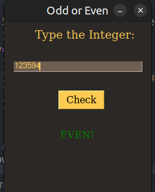

# Odd Or Even GUI

This was a simple app whose sole purpose was for me to familiarize myself with
the PySimpleGui Framework.

PySimpleGUI is a python library that wraps tkinter, Qt (pyside2), wxPython and Remi (for browser support), allowing very fast and simple-to-learn GUI programming. PySimpleGUI defaults to using tkinter, but the user can change to another supported GUI library by just changing one line.


## The simple UI 

With PySimpleUI I was able to create a simplistic UI with few lines of code.





## How to use:

#### Navigate to the project and run:
```python
python oddGui.py

```

<br/> 

#### In case you are using Linux or mac, Run:
```python3
python3 oddGui.py